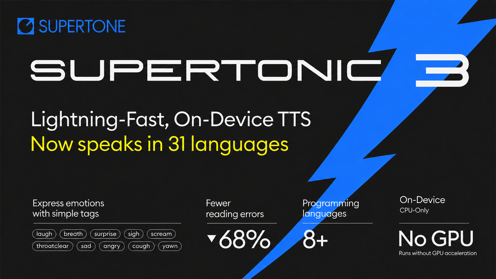

# Supertonic TTS — Local WebSocket Server & Web UI

> A small toolkit I built **on top of** [Supertone's Supertonic](https://github.com/supertone-inc/supertonic) to turn the TTS engine into a local WebSocket server with a browser-based client. Everything in this section lives in [`tool/`](tool/) and is **not part of the upstream project**.

<p align="center">
  
</p>

## ✨ What's in `tool/`

| File | Description |
|------|-------------|
| [`ws_tts_server.py`](tool/ws_tts_server.py) | WebSocket TTS server. Auto-detects GPU (DirectML / CUDA) and falls back to CPU. |
| [`start_tts_server.bat`](tool/start_tts_server.bat) | One-click launcher for Windows. |
| [`tts_web.html`](tool/tts_web.html) | Browser client to test TTS live. |
| [`WEBSOCKET_API.md`](tool/WEBSOCKET_API.md) | Protocol reference for integrating apps / extensions. |

## 🚀 Quick Start (Windows)

**1. Set up the upstream project first** (only needed once, see [Upstream Setup](#-upstream-setup) below).

**2. Start the server:**

```bat
cd tool
start_tts_server.bat
```

The server listens on `ws://127.0.0.1:8765` by default.

**3. Open the web UI:**

Double-click `tool/tts_web.html` (or drag it into a browser) and start synthesizing.

## 🔌 WebSocket API (at a glance)

**Connect:** `ws://127.0.0.1:8765`

**Request (JSON):**
```json
{ "text": "Hello world", "lang": "en", "voice": "M1", "speed": 1.05 }
```

**Response:**
1. A JSON `audio_meta` frame — `{ "type": "audio_meta", "duration", "latency_ms", "size" }`
2. A binary frame containing a complete WAV file (16-bit PCM mono).

**Options:**
- `voice`: `M1–M5` (male), `F1–F5` (female)
- `speed`: `0.25` – `4.0`
- `lang`: `en`, `vi`, `ko`, `ja`, `fr`, `de`, `es`, `pt`, `it`, … (31 languages)

Full protocol spec: [`tool/WEBSOCKET_API.md`](tool/WEBSOCKET_API.md).

## 🛠️ CLI Options

```bat
uv run --project ../py python ws_tts_server.py [--port 8765] [--cpu]
```

| Flag | Meaning |
|------|---------|
| `--port N` | Override the WebSocket port (default `8765`, env `WS_PORT`). |
| `--cpu` | Force CPU inference and skip GPU detection. |

---

## 📦 Upstream Setup

The server reuses the upstream Python runtime in [`py/`](py/) and the ONNX assets in `assets/`. You need these once:

```bash
# 1. Download ONNX models + preset voices (requires git-lfs)
git lfs install
git clone https://huggingface.co/Supertone/supertonic-3 assets

# 2. Install Python deps for the upstream runtime
cd py
uv sync
cd ..
```

After that, `start_tts_server.bat` handles the rest.

---

## About Upstream Supertonic

[**Supertonic**](https://github.com/supertone-inc/supertonic) by Supertone Inc. is a lightning-fast, on-device TTS system powered by ONNX Runtime. It runs fully offline, supports **31 languages**, and ships with ready-to-use examples in Python, Node.js, Browser, Java, C++, C#, Go, Swift, Rust, iOS, and Flutter (see the corresponding folders in this repo).

- **Models & demo:** [Hugging Face — Supertonic 3](https://huggingface.co/Supertone/supertonic-3) · [Interactive Demo](https://huggingface.co/spaces/Supertone/supertonic-3)
- **Python SDK:** `pip install supertonic` — docs at [supertone-inc.github.io/supertonic-py](https://supertone-inc.github.io/supertonic-py)
- **Upstream README & citations:** see the [original repository](https://github.com/supertone-inc/supertonic) for architecture details, benchmarks, paper citations, and per-language examples.

## License

- Sample code (including `tool/`): **MIT** — see [`LICENSE`](LICENSE).
- ONNX model weights: **OpenRAIL-M** — see the [model license on Hugging Face](https://huggingface.co/Supertone/supertonic-3/blob/main/LICENSE).

Upstream © 2026 Supertone Inc. Additions in `tool/` © their respective author.
