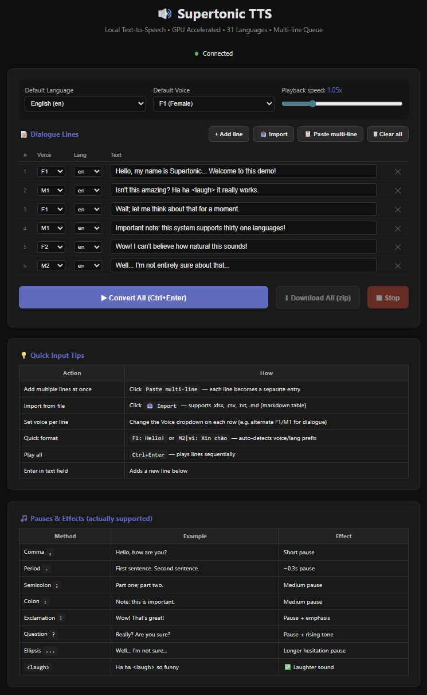

# Supertonic TTS — Local WebSocket Server & Web UI

> A small toolkit I built **on top of** [Supertone's Supertonic](https://github.com/supertone-inc/supertonic) to turn the TTS engine into a local WebSocket server with a feature-rich browser client. Everything in this section lives in [`tool/`](tool/) and is **not part of the upstream project**.

<p align="center">
  
</p>

---

## ✨ Highlights

- 🚀 **One-click / one-command launchers** — Windows `.bat` plus Ubuntu/macOS `.sh`, both auto-install deps and boot the server.
- ⚡ **Accelerated when available** — auto-detects CUDA → DirectML → CoreML → CPU with CPU fallback if an accelerator fails.
- 🧠 **Batch inference** — multiple requests within a 100 ms window are merged into a single GPU call, so 6 lines render as fast as 1.
- 🎭 **Multi-line dialogue queue** — assign a different voice/language per line for true conversational TTS.
- 📥 **Bulk import** — load dialogue from `.xlsx`, `.csv`, `.txt`, `.srt`, or markdown tables.
- 📦 **Batch ZIP download** — convert N lines, get N `.wav` files in one zip.
- 🎞️ **Video localization MVP** — upload video, transcribe to SRT, translate locally with Ollama (`hf.co/tencent/Hy-MT2-7B-GGUF:Q4_K_M`) or through Cerebras, optionally replace audio with Vietnamese TTS voice-over, and burn Vietnamese subtitles into the final MP4.
- 🔌 **Open WebSocket API** — drop-in client examples for Browser, Chrome MV3 extension, Node.js, Python.
- 🔄 **Upstream sync helper** — `sync_upstream.bat` keeps the fork in lock-step with `supertone-inc/supertonic`.

---

## 📁 What's in `tool/`

| File / Folder | Description |
|---|---|
| [`ws_tts_server.py`](tool/ws_tts_server.py) | WebSocket TTS server. Auto-detects providers (CUDA / DirectML / CoreML / CPU), batches concurrent requests, retries inference failures, and handles client disconnect gracefully. |
| [`tts_web.html`](tool/tts_web.html) | Standalone browser client. Multi-line dialogue queue, per-line voice/lang, file import, sequential auto-play, batch ZIP export. No build step. |
| [`video_pipeline_server.py`](tool/video_pipeline_server.py) | FastAPI video localization server. Extracts audio, transcribes with faster-whisper, translates with Cerebras, generates Vietnamese TTS voice-over, and exports soft-subtitle and burned-subtitle MP4 files. |
| [`video_localizer_web.html`](tool/video_localizer_web.html) | Browser UI for the video localization MVP. Upload video, watch progress, and download SRT/video outputs. |
| [`start_tts_server.bat`](tool/start_tts_server.bat) | One-click Windows launcher. Runs `uv sync`, then starts the server with banner + usage hints. |
| [`start_tts_server.sh`](tool/start_tts_server.sh) | Ubuntu/macOS launcher. Uses `uv sync` when available, falls back to `python3 -m venv` + `pip`, then starts the server. |
| [`start_video_localizer.bat`](tool/start_video_localizer.bat) | Windows launcher for the video localization server. |
| [`start_video_localizer.sh`](tool/start_video_localizer.sh) | Ubuntu/macOS launcher for the video localization server. |
| [`sync_upstream.bat`](tool/sync_upstream.bat) | Pulls latest `upstream/main`, merges into local `main`, and pushes to `origin`. Detects merge conflicts. |
| [`WEBSOCKET_API.md`](tool/WEBSOCKET_API.md) | Full protocol spec + integration guides (vanilla JS, Chrome MV3 extension with offscreen audio, Node, Python). |
| [`samples/`](tool/samples/) | Ready-to-import dialogue samples (`.csv`, `.md` table, `.txt` with `F1: text` prefix format). |

---

## 🚀 Quick Start

**1. Set up the upstream project first** — only needed once, see [Upstream Setup](#-upstream-setup) below.

**2. Start the server.**

Windows:

```bat
cd tool
start_tts_server.bat
```

Ubuntu/macOS:

```bash
cd tool
sh start_tts_server.sh
```

From the repo root, you can also run the Unix launcher directly:

```bash
chmod +x tool/start_tts_server.sh
./tool/start_tts_server.sh
```

The server listens on `ws://127.0.0.1:8765`. First launch warms up the selected provider; subsequent inferences are faster.

**3. Open the web UI:**

Double-click [`tool/tts_web.html`](tool/tts_web.html) — it connects automatically.

---

## ✅ Platform Support

The launchers and dependencies are selected by OS and CPU architecture so the same repo can run on more machines without hand-editing dependency files.

| Platform | Launcher | Default runtime path | Acceleration |
|---|---|---|---|
| Windows x64 | `tool/start_tts_server.bat` | `uv sync` → `py/.venv/Scripts/python.exe` | CUDA, DirectML, CPU fallback |
| Windows ARM64 | `tool/start_tts_server.bat` | `uv sync` → `py/.venv/Scripts/python.exe` | CPU fallback |
| Ubuntu/Linux x64 | `tool/start_tts_server.sh` | `uv sync` or `python3 -m venv` fallback | CUDA, CPU fallback |
| Ubuntu/Linux ARM64 | `tool/start_tts_server.sh` | `uv sync` or `python3 -m venv` fallback | CPU fallback |
| macOS Intel / Apple Silicon | `tool/start_tts_server.sh` | `uv sync` or `python3 -m venv` fallback | CPU fallback; CoreML only if your ONNX Runtime build exposes it |

Recommended prerequisites:
- Python 3.10+
- [`uv`](https://docs.astral.sh/uv/) for the most reliable install path
- `git-lfs` for downloading model assets

The Ubuntu/macOS launcher can fall back to `python3 -m venv` and `pip` if `uv` is not installed. The Windows launcher requires `uv`.

---

## 🌐 Web UI Features (`tts_web.html`)

A self-contained HTML page (no build, no server). Open with any modern browser.

### Multi-line dialogue queue
- Each row has its own **Voice** and **Language** selector — perfect for two-speaker dialogues, narration with character voices, or multi-language announcements.
- Visual highlight on the currently playing row.
- `Enter` adds a new row below; `Backspace` on an empty row deletes it.

### Bulk input
| Action | How |
|---|---|
| **Paste multi-line** | Click `📋 Paste multi-line`. Each pasted line becomes a row. Supports `F1: hello` / `M2\|vi: xin chào` shorthand to set voice + lang inline. |
| **Import file** | Click `📥 Import`. Supports `.xlsx` (via SheetJS), `.csv`, `.md` markdown tables, plain `.txt`, and subtitle `.srt`. |
| **Voice assignment modes** | *Use default* / *Alternate F1↔M1* (auto-dialogue) / *From column* (read from imported file). |

### Output
- **Convert All (Ctrl+Enter)** — synthesizes the whole queue, plays back sequentially with the chosen playback speed (`preservesPitch = true`, so no chipmunk effect).
- **Per-line audio player** with individual `⬇` download button (`01_F1_en_Hello.wav`).
- **⬇ Download All (zip)** — bundles everything into `tts_batch_YYYY-MM-DD.zip`.
- **⏹ Stop** — halts mid-batch and cancels playback.

### Connection status
- Live indicator dot (green = connected, red = disconnected).
- Auto-reconnect on close with 2 s backoff.

---

## 🎞️ Video Localization MVP

The video localizer is a separate tool so the TTS server stays simple. It currently supports this workflow:

```text
video -> audio.wav -> original.srt -> vi.srt -> Vietnamese TTS -> MP4 with burned Vietnamese subtitles
```

Prerequisites:
- `ffmpeg` and `ffprobe` on PATH.
- Python dependencies installed through `uv sync` or the provided launcher.
- For local Vietnamese translation: Ollama with `hf.co/tencent/Hy-MT2-7B-GGUF:Q4_K_M` (`ollama pull hf.co/tencent/Hy-MT2-7B-GGUF:Q4_K_M`).
- Optional Cerebras fallback: `CEREBRAS_API_KEY`. The local web UI shows a masked status hint when a server key is configured.

Ubuntu/macOS:

```bash
export CEREBRAS_API_KEY="your-key"
chmod +x tool/start_video_localizer.sh
./tool/start_video_localizer.sh
```

Windows PowerShell:

```powershell
$env:CEREBRAS_API_KEY="your-key"
.\tool\start_video_localizer.bat
```

Then open:

```text
http://127.0.0.1:8787
```

Outputs are saved under `tool/jobs/<job_id>/`:
- `audio.wav`
- `original.srt`
- `vi.srt`
- `output_soft_subtitles.mp4`
- `output_vietnamese_only.mp4` when **Vietnamese voice-over** is enabled.
- `output_vietnamese_burned.mp4` with Vietnamese subtitles rendered directly into the video frames.

The current voice-over mode replaces the original audio with generated Vietnamese TTS aligned to subtitle timestamps.

---

## 🖥️ Server Features (`ws_tts_server.py`)

### Provider auto-detection
At startup, the server probes ONNX Runtime providers in this order:
1. **CUDA** (NVIDIA on Windows/Linux x86_64) — picks up bundled CUDA/NVIDIA libraries from the virtualenv when present.
2. **DirectML** (Windows DX12 GPUs) — sets `enable_mem_pattern=False` and sequential execution to dodge the DirectML command-queue overflow bug.
3. **CoreML** (macOS, only if the installed ONNX Runtime exposes it).
4. **CPU** fallback.

If an accelerator is detected but fails during initialization or warmup, `auto` mode falls back to CPU instead of crashing the launcher.

Pass `--cpu` to skip accelerator detection entirely, or `--provider cpu|cuda|directml|coreml|auto` to choose a preferred provider.

### Batch inference
- Incoming requests are pushed into an `asyncio.Queue`.
- A worker waits **100 ms** to collect a batch, groups by voice (style), then runs **one** ONNX inference for the whole group.
- A global `asyncio.Lock` serializes batches → DirectML stays happy.
- Retry up to 3× on transient inference errors before surfacing an error to the client.

### Robustness
- **Warmup on boot** with `total_step=4` then `total_step=8` to avoid DirectML's first-run timeout.
- **Disconnect-safe**: if a client drops mid-inference, the server discards its result and keeps serving others.
- **Echo `text` in audio_meta** so clients can pair binary frames with their original requests when many are in flight.

### CLI

```bash
cd tool
uv run --project ../py python ws_tts_server.py [--port 8765] [--cpu] [--provider auto|cpu|cuda|directml|coreml]
```

| Flag | Meaning |
|---|---|
| `--port N` | Override the WebSocket port (default `8765`, env `WS_PORT`). |
| `--provider NAME` | Prefer `auto`, `cpu`, `cuda`, `directml`, or `coreml` (default `auto`, env `TTS_PROVIDER`). |
| `--cpu` | Shortcut for `--provider cpu`. |

Examples:

```bash
# Force CPU on any OS
sh start_tts_server.sh --cpu

# Use a custom port
sh start_tts_server.sh --port 9000

# Prefer CUDA on Linux
TTS_PROVIDER=cuda sh start_tts_server.sh
```

```bat
REM Force CPU on Windows
start_tts_server.bat --cpu

REM Use a custom port
start_tts_server.bat --port 9000
```

---

## 🔌 WebSocket API (at a glance)

**Connect:** `ws://127.0.0.1:8765`

**Handshake (server → client, on connect):**
```json
{ "status": "connected", "voices": ["F1", ..., "M5"], "languages": ["en", "vi", "ko", ...] }
```

**Request (client → server):**
```json
{ "text": "Hello world", "lang": "en", "voice": "M1", "speed": 1.05 }
```

**Response:** for each request, the server sends two paired frames:
1. JSON `audio_meta` — `{ type, text, duration, latency_ms, size }`
2. Binary frame — a complete WAV file (16-bit PCM mono).

**Options:**
- `voice`: `M1–M5` (male), `F1–F5` (female) — case-insensitive, falls back to `M1`.
- `speed`: `0.25 – 4.0` (apply on client via `audio.playbackRate`; `preservesPitch = true`).
- `lang`: `en`, `vi`, `ko`, `ja`, `fr`, `de`, `es`, `pt`, `it`, … (31 languages).
- Inline markers in `text`: `<laugh>`, `<breath>`, `<sigh>`, plus standard punctuation for natural pauses.

Full spec with Chrome MV3 / Node / Python examples → [`tool/WEBSOCKET_API.md`](tool/WEBSOCKET_API.md).

---

## 📦 Upstream Setup

The server reuses the upstream Python runtime in [`py/`](py/) and the ONNX assets in `assets/`. You need these once:

```bash
# 1. Download ONNX models + preset voices (requires git-lfs)
git lfs install
git clone https://huggingface.co/Supertone/supertonic-3 assets

# 2. Install Python deps for the upstream runtime
cd py
uv sync
cd ..
```

After that, `start_tts_server.bat` on Windows or `start_tts_server.sh` on Ubuntu/macOS handles the rest.

### Troubleshooting

| Symptom | Fix |
|---|---|
| `Missing ONNX assets` | Run the asset setup commands above from the repo root. |
| `uv is required but was not found` on Windows | Install `uv`, then reopen the terminal and run `tool/start_tts_server.bat` again. |
| Ubuntu/macOS says `python3 is required` | Install Python 3.10+ for your OS, or install `uv`. |
| CUDA/DirectML/CoreML fails at startup | Run with `--cpu`; `auto` mode should also fall back to CPU when possible. |
| Port already in use | Run with `--port 9000`, or set `WS_PORT` before starting the launcher. |
| macOS is slow | This is expected on CPU fallback. Use shorter batches or fewer concurrent lines. |

### Keeping in sync with upstream

If you fork this repo, [`tool/sync_upstream.bat`](tool/sync_upstream.bat) automates the maintenance loop:

```bat
cd tool
sync_upstream.bat
```

It runs `git fetch upstream` → `git merge upstream/main` → `git push origin main`, and stops cleanly if it detects a conflict so you can resolve it manually.

---

## About Upstream Supertonic

[**Supertonic**](https://github.com/supertone-inc/supertonic) by Supertone Inc. is a lightning-fast, on-device TTS system powered by ONNX Runtime. It runs fully offline, supports **31 languages**, and ships with ready-to-use examples in Python, Node.js, Browser, Java, C++, C#, Go, Swift, Rust, iOS, and Flutter (see the corresponding folders in this repo).

- **Models & demo:** [Hugging Face — Supertonic 3](https://huggingface.co/Supertone/supertonic-3) · [Interactive Demo](https://huggingface.co/spaces/Supertone/supertonic-3)
- **Python SDK:** `pip install supertonic` — docs at [supertone-inc.github.io/supertonic-py](https://supertone-inc.github.io/supertonic-py)
- **Upstream README & citations:** see the [original repository](https://github.com/supertone-inc/supertonic) for architecture details, benchmarks, paper citations, and per-language examples.

## License

- Sample code (including `tool/`): **MIT** — see [`LICENSE`](LICENSE).
- ONNX model weights: **OpenRAIL-M** — see the [model license on Hugging Face](https://huggingface.co/Supertone/supertonic-3/blob/main/LICENSE).

Upstream © 2026 Supertone Inc. Additions in `tool/` © their respective author.
